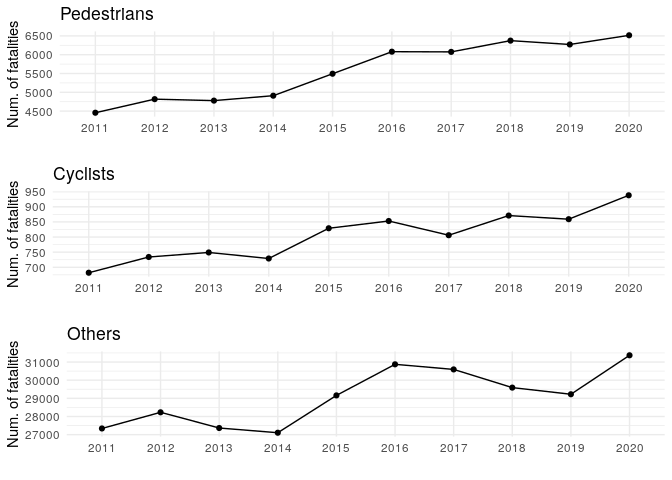
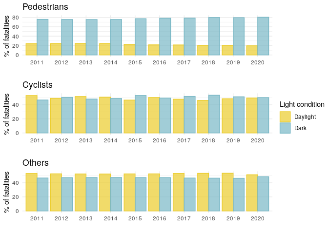
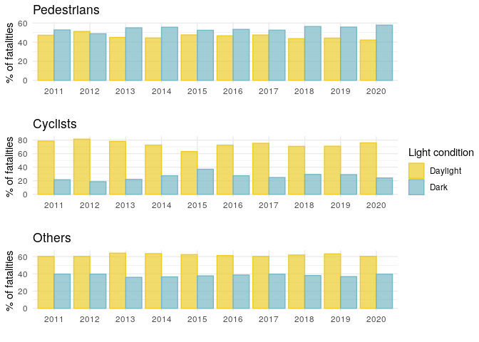

Road traffic fatalities by light condition: a comparative analysis
between the US and the UK
================

# US 2011-2020 (FARS data)

Table 1. Road traffic fatalities by type and light condition, US
2011-2020

<table class=" lightable-paper lightable-striped" style="font-family: &quot;Arial Narrow&quot;, arial, helvetica, sans-serif; width: auto !important; margin-left: auto; margin-right: auto;">
<thead>
<tr>
<th style="text-align:left;">
Type
</th>
<th style="text-align:left;">
Light condition
</th>
<th style="text-align:left;">
Light condition in detail
</th>
<th style="text-align:right;">
Num.
</th>
<th style="text-align:right;">
%
</th>
</tr>
</thead>
<tbody>
<tr grouplength="6">
<td colspan="5" style="border-bottom: 1px solid;">
<strong></strong>
</td>
</tr>
<tr>
<td style="text-align:left;padding-left: 2em;" indentlevel="1">
Pedestrians
</td>
<td style="text-align:left;">
Daylight
</td>
<td style="text-align:left;">
Daylight
</td>
<td style="text-align:right;">
7676
</td>
<td style="text-align:right;">
20.96
</td>
</tr>
<tr>
<td style="text-align:left;padding-left: 2em;" indentlevel="1">
Pedestrians
</td>
<td style="text-align:left;">
Dark
</td>
<td style="text-align:left;">
Dark - Lighted
</td>
<td style="text-align:right;">
14316
</td>
<td style="text-align:right;">
39.09
</td>
</tr>
<tr>
<td style="text-align:left;padding-left: 2em;" indentlevel="1">
Pedestrians
</td>
<td style="text-align:left;">
Dark
</td>
<td style="text-align:left;">
Dark - Not Lighted
</td>
<td style="text-align:right;">
12821
</td>
<td style="text-align:right;">
35.00
</td>
</tr>
<tr>
<td style="text-align:left;padding-left: 2em;" indentlevel="1">
Pedestrians
</td>
<td style="text-align:left;">
Dark
</td>
<td style="text-align:left;">
Dark - Unknown Lighting
</td>
<td style="text-align:right;">
472
</td>
<td style="text-align:right;">
1.29
</td>
</tr>
<tr>
<td style="text-align:left;padding-left: 2em;" indentlevel="1">
Pedestrians
</td>
<td style="text-align:left;">
Dark
</td>
<td style="text-align:left;">
Dawn
</td>
<td style="text-align:right;">
603
</td>
<td style="text-align:right;">
1.65
</td>
</tr>
<tr>
<td style="text-align:left;padding-left: 2em;" indentlevel="1">
Pedestrians
</td>
<td style="text-align:left;">
Dark
</td>
<td style="text-align:left;">
Dusk
</td>
<td style="text-align:right;">
739
</td>
<td style="text-align:right;">
2.02
</td>
</tr>
<tr grouplength="6">
<td colspan="5" style="border-bottom: 1px solid;">
<strong></strong>
</td>
</tr>
<tr>
<td style="text-align:left;padding-left: 2em;" indentlevel="1">
Cyclists
</td>
<td style="text-align:left;">
Daylight
</td>
<td style="text-align:left;">
Daylight
</td>
<td style="text-align:right;">
2482
</td>
<td style="text-align:right;">
48.33
</td>
</tr>
<tr>
<td style="text-align:left;padding-left: 2em;" indentlevel="1">
Cyclists
</td>
<td style="text-align:left;">
Dark
</td>
<td style="text-align:left;">
Dark - Lighted
</td>
<td style="text-align:right;">
1257
</td>
<td style="text-align:right;">
24.47
</td>
</tr>
<tr>
<td style="text-align:left;padding-left: 2em;" indentlevel="1">
Cyclists
</td>
<td style="text-align:left;">
Dark
</td>
<td style="text-align:left;">
Dark - Not Lighted
</td>
<td style="text-align:right;">
1110
</td>
<td style="text-align:right;">
21.61
</td>
</tr>
<tr>
<td style="text-align:left;padding-left: 2em;" indentlevel="1">
Cyclists
</td>
<td style="text-align:left;">
Dark
</td>
<td style="text-align:left;">
Dark - Unknown Lighting
</td>
<td style="text-align:right;">
43
</td>
<td style="text-align:right;">
0.84
</td>
</tr>
<tr>
<td style="text-align:left;padding-left: 2em;" indentlevel="1">
Cyclists
</td>
<td style="text-align:left;">
Dark
</td>
<td style="text-align:left;">
Dawn
</td>
<td style="text-align:right;">
103
</td>
<td style="text-align:right;">
2.01
</td>
</tr>
<tr>
<td style="text-align:left;padding-left: 2em;" indentlevel="1">
Cyclists
</td>
<td style="text-align:left;">
Dark
</td>
<td style="text-align:left;">
Dusk
</td>
<td style="text-align:right;">
141
</td>
<td style="text-align:right;">
2.75
</td>
</tr>
<tr grouplength="6">
<td colspan="5" style="border-bottom: 1px solid;">
<strong></strong>
</td>
</tr>
<tr>
<td style="text-align:left;padding-left: 2em;" indentlevel="1">
Others
</td>
<td style="text-align:left;">
Daylight
</td>
<td style="text-align:left;">
Daylight
</td>
<td style="text-align:right;">
94891
</td>
<td style="text-align:right;">
52.80
</td>
</tr>
<tr>
<td style="text-align:left;padding-left: 2em;" indentlevel="1">
Others
</td>
<td style="text-align:left;">
Dark
</td>
<td style="text-align:left;">
Dark - Lighted
</td>
<td style="text-align:right;">
27897
</td>
<td style="text-align:right;">
15.52
</td>
</tr>
<tr>
<td style="text-align:left;padding-left: 2em;" indentlevel="1">
Others
</td>
<td style="text-align:left;">
Dark
</td>
<td style="text-align:left;">
Dark - Not Lighted
</td>
<td style="text-align:right;">
47816
</td>
<td style="text-align:right;">
26.61
</td>
</tr>
<tr>
<td style="text-align:left;padding-left: 2em;" indentlevel="1">
Others
</td>
<td style="text-align:left;">
Dark
</td>
<td style="text-align:left;">
Dark - Unknown Lighting
</td>
<td style="text-align:right;">
1092
</td>
<td style="text-align:right;">
0.61
</td>
</tr>
<tr>
<td style="text-align:left;padding-left: 2em;" indentlevel="1">
Others
</td>
<td style="text-align:left;">
Dark
</td>
<td style="text-align:left;">
Dawn
</td>
<td style="text-align:right;">
3527
</td>
<td style="text-align:right;">
1.96
</td>
</tr>
<tr>
<td style="text-align:left;padding-left: 2em;" indentlevel="1">
Others
</td>
<td style="text-align:left;">
Dark
</td>
<td style="text-align:left;">
Dusk
</td>
<td style="text-align:right;">
4495
</td>
<td style="text-align:right;">
2.50
</td>
</tr>
</tbody>
</table>

<!-- -->

Figure 1. Road traffic fatalities by type and year, US 2011-2020

<!-- -->

Figure 2. % of road traffic fatalities by type, year, and light
condition, US 2011-2020

# UK 2011-2020 (STATS19 data)

Table 2. Road traffic fatalities by type and light condition, UK
2011-2020

<table class=" lightable-paper lightable-striped" style="font-family: &quot;Arial Narrow&quot;, arial, helvetica, sans-serif; width: auto !important; margin-left: auto; margin-right: auto;">
<thead>
<tr>
<th style="text-align:left;">
Type
</th>
<th style="text-align:left;">
Light condition
</th>
<th style="text-align:left;">
Light condition in detail
</th>
<th style="text-align:right;">
Num.
</th>
<th style="text-align:right;">
%
</th>
</tr>
</thead>
<tbody>
<tr grouplength="5">
<td colspan="5" style="border-bottom: 1px solid;">
<strong></strong>
</td>
</tr>
<tr>
<td style="text-align:left;padding-left: 2em;" indentlevel="1">
Pedestrians
</td>
<td style="text-align:left;">
Daylight
</td>
<td style="text-align:left;">
Daylight
</td>
<td style="text-align:right;">
1985
</td>
<td style="text-align:right;">
46.00
</td>
</tr>
<tr>
<td style="text-align:left;padding-left: 2em;" indentlevel="1">
Pedestrians
</td>
<td style="text-align:left;">
Dark
</td>
<td style="text-align:left;">
Darkness - lights lit
</td>
<td style="text-align:right;">
1466
</td>
<td style="text-align:right;">
33.97
</td>
</tr>
<tr>
<td style="text-align:left;padding-left: 2em;" indentlevel="1">
Pedestrians
</td>
<td style="text-align:left;">
Dark
</td>
<td style="text-align:left;">
Darkness - lights unlit
</td>
<td style="text-align:right;">
79
</td>
<td style="text-align:right;">
1.83
</td>
</tr>
<tr>
<td style="text-align:left;padding-left: 2em;" indentlevel="1">
Pedestrians
</td>
<td style="text-align:left;">
Dark
</td>
<td style="text-align:left;">
Darkness - no lighting
</td>
<td style="text-align:right;">
705
</td>
<td style="text-align:right;">
16.34
</td>
</tr>
<tr>
<td style="text-align:left;padding-left: 2em;" indentlevel="1">
Pedestrians
</td>
<td style="text-align:left;">
Dark
</td>
<td style="text-align:left;">
Darkness - lighting unknown
</td>
<td style="text-align:right;">
80
</td>
<td style="text-align:right;">
1.85
</td>
</tr>
<tr grouplength="5">
<td colspan="5" style="border-bottom: 1px solid;">
<strong></strong>
</td>
</tr>
<tr>
<td style="text-align:left;padding-left: 2em;" indentlevel="1">
Cyclists
</td>
<td style="text-align:left;">
Daylight
</td>
<td style="text-align:left;">
Daylight
</td>
<td style="text-align:right;">
808
</td>
<td style="text-align:right;">
74.13
</td>
</tr>
<tr>
<td style="text-align:left;padding-left: 2em;" indentlevel="1">
Cyclists
</td>
<td style="text-align:left;">
Dark
</td>
<td style="text-align:left;">
Darkness - lights lit
</td>
<td style="text-align:right;">
157
</td>
<td style="text-align:right;">
14.40
</td>
</tr>
<tr>
<td style="text-align:left;padding-left: 2em;" indentlevel="1">
Cyclists
</td>
<td style="text-align:left;">
Dark
</td>
<td style="text-align:left;">
Darkness - lights unlit
</td>
<td style="text-align:right;">
10
</td>
<td style="text-align:right;">
0.92
</td>
</tr>
<tr>
<td style="text-align:left;padding-left: 2em;" indentlevel="1">
Cyclists
</td>
<td style="text-align:left;">
Dark
</td>
<td style="text-align:left;">
Darkness - no lighting
</td>
<td style="text-align:right;">
110
</td>
<td style="text-align:right;">
10.09
</td>
</tr>
<tr>
<td style="text-align:left;padding-left: 2em;" indentlevel="1">
Cyclists
</td>
<td style="text-align:left;">
Dark
</td>
<td style="text-align:left;">
Darkness - lighting unknown
</td>
<td style="text-align:right;">
5
</td>
<td style="text-align:right;">
0.46
</td>
</tr>
<tr grouplength="5">
<td colspan="5" style="border-bottom: 1px solid;">
<strong></strong>
</td>
</tr>
<tr>
<td style="text-align:left;padding-left: 2em;" indentlevel="1">
Motorised vehicles occupants
</td>
<td style="text-align:left;">
Daylight
</td>
<td style="text-align:left;">
Daylight
</td>
<td style="text-align:right;">
7431
</td>
<td style="text-align:right;">
61.76
</td>
</tr>
<tr>
<td style="text-align:left;padding-left: 2em;" indentlevel="1">
Motorised vehicles occupants
</td>
<td style="text-align:left;">
Dark
</td>
<td style="text-align:left;">
Darkness - lights lit
</td>
<td style="text-align:right;">
1859
</td>
<td style="text-align:right;">
15.45
</td>
</tr>
<tr>
<td style="text-align:left;padding-left: 2em;" indentlevel="1">
Motorised vehicles occupants
</td>
<td style="text-align:left;">
Dark
</td>
<td style="text-align:left;">
Darkness - lights unlit
</td>
<td style="text-align:right;">
93
</td>
<td style="text-align:right;">
0.77
</td>
</tr>
<tr>
<td style="text-align:left;padding-left: 2em;" indentlevel="1">
Motorised vehicles occupants
</td>
<td style="text-align:left;">
Dark
</td>
<td style="text-align:left;">
Darkness - no lighting
</td>
<td style="text-align:right;">
2450
</td>
<td style="text-align:right;">
20.36
</td>
</tr>
<tr>
<td style="text-align:left;padding-left: 2em;" indentlevel="1">
Motorised vehicles occupants
</td>
<td style="text-align:left;">
Dark
</td>
<td style="text-align:left;">
Darkness - lighting unknown
</td>
<td style="text-align:right;">
199
</td>
<td style="text-align:right;">
1.65
</td>
</tr>
</tbody>
</table>

<!-- -->

Figure 3. Road traffic fatalities by type and year, UK 2011-2020

<!-- -->

Figure 4. UK % of road traffic fatalities by type, year, and light
condition, UK 2011-2020

# Next steps

- Add a total row per type of fatality in each table.

- Estimate risk indices. Get denominator (distance, time, etc) through
  the NHTS and NTS. Tricky step as we need to calculate veh-km by light
  condition (daylight/dark). I suppose we need to create function to
  make this calculation. Problems here: not all trips will be A or B,
  different hour times in the US, etc.

- Compare cities?

- Check association of risk indices with the sale of SUVs, community
  severance (pedestrian crossings length and density), alcohol
  consumption, gender, ethnicity, income, etc. Safety in numbers is also
  interesting: less walking may mean higher risk.

# References

Some interesting non-academic sources:

- <https://www.theguardian.com/world/2022/nov/22/he-was-fast-he-ran-you-right-over-what-its-like-to-get-hit-by-an-suv?CMP=Share_AndroidApp_Other>

- <https://www.vox.com/23178764/florida-us19-deadliest-pedestrian-fatality-crisis>

- <https://www.youtube.com/watch?v=0-nthHT-J1k&ab_channel=Vox>
